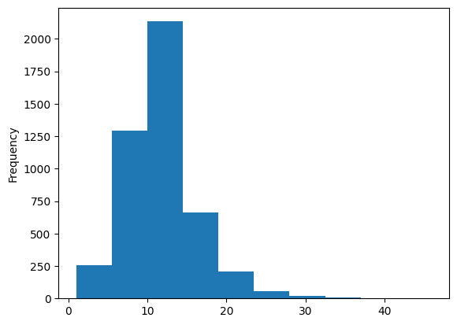
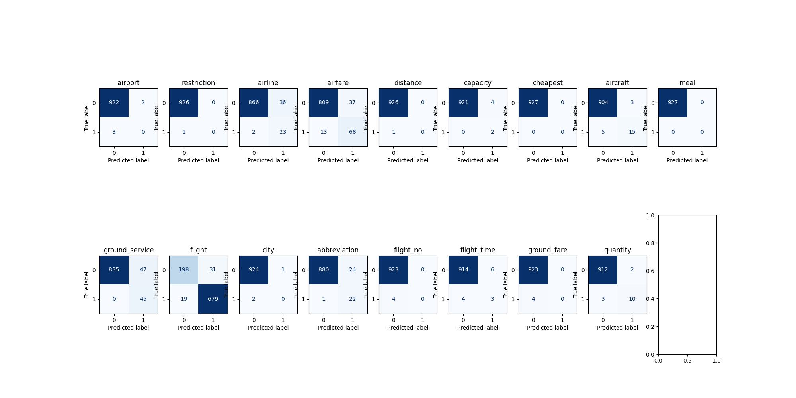

# Running the server, training, evaluation

## Setup
```
pip install -r requirements.txt
```

## Running the server
For the finally selected feedforward model
```
python server.py --model model_nn.pkl
```

For the not selected LSTM model
```
python server.py --model model_lstm.pkl
```

Model with pretrained GloVe embedding is not shared on github as model size is very large.

## Running the training
- NN model
```
python train.py --model_type nn
```

- BiLSTM Attention model
```
python train.py --model_type lstm
```

- BiLSTM Attention model GloVe model
```
wget http://nlp.stanford.edu/data/glove.6B.zip
unzip glove.6B.zip
python train.py --model_type lstm --embed_path glove.6B.100d.txt
```

## Evaluating the model on test dataset
- NN model
```
python eval_model.py --model_type nn --model_data_file model_lstm.pkl
```

- BiLSTM Attention model
```
python eval_model.py --model_type lstm --model_data_file model_lstm.pkl
```

- BiLSTM Attention model GloVe model
```
python eval_model.py --model_type lstm --model_data_file model_lstmglove.pkl
```

# Approach Used

## Problem definition
I have used multi label classification methodology to solve the problem. This allows the model to label multiple classes for a given text prompt. This allows me to handle labels like 'flight+flightno' as two seperate intent labels 'flight' and 'flightno' and predict the probability of each seperately.

## Training Data Distribution
### Class distribution
```
flight                        3426
airfare                        403
ground_service                 235
airline                        148
abbreviation                   108
aircraft                        78
flight_time                     52
quantity                        49
distance                        20
city                            18
airport                         18
ground_fare                     17
flight+airfare                  17
capacity                        16
flight_no                       12
meal                             6
restriction                      5
airline+flight_no                2
ground_service+ground_fare       1
airfare+flight_time              1
cheapest                         1
aircraft+flight+flight_no        1
```
The possibility of multiple classes for a text input motivates me to structure the problem as multilabel classification.


### Multilabel distribution
```
cheapest             1
restriction          5
meal                 6
flight_no           15
capacity            16
ground_fare         18
airport             18
city                18
distance            20
quantity            49
flight_time         53
aircraft            79
abbreviation       108
airline            150
ground_service     236
airfare            421
flight            3444
```
- The imbalanced distribution in positive and negative class motivated me to use weighted binary cross entropy as loss function. 
- When splitting the dataset in train and validation, iterative stratification is used to split the dataset proportionally based on class distribution.
- During evaluation I compare the confusion matrix and f1 score for each label. I also use macro/micro averaged scores to compare results.

### Text input word count distribution 


The text size is fairly small with most of input in range of 10-15 words. RNN based model like LSTM should be able to model sequence of this size.

## Tools used
I have used following python libraries to help build my solution

- `pytorch` - This is used to implement full flow of building machine learning model. Loading the data in batches, passing to the model and backpropagation.
- `Lightning` - This helps in checkpointing the model and keep track of performance of different model versions and hyperparameter tunin. It also remove a lot of boilerplate code in pytorch like backprop, setting gradients.
- `sklearn` - This is used for baseline model and calculating performance metrics for classification tasks

## Bug 
Model load after app run is the bug

## Model
I have experimented with three different models.

### Feedforward Network with TfIdf based feature vector

#### Motivations

- Tfidf based feature could work for this problem as some keywords would be more important for some classes.
- Simple Neural Network can handle tfidf based feature.

### Bi-LSTM with Attention with embedding layer

#### Motivations
- LSTM model better encodes the sequence information from text.
- BiLSTM allows model to encode tokens using previous and next tokens.
- Attention layer allows the model to decide how much to attend to each token when predicting labels.

### Bi-LSTM with Attention with pretrained GloVe embeddings -> Same as previous but with pretrained glove embeddings.
#### Motivations
Using pretrained embedding would allow model to handle words it has not seen before better.

## Loss Functions
I experimented with different losses like Binary Cross Entropy, Margin Loss and Weighted Binary Cross Entropy. Weighted Binary Cross Entropy works best for this problem as it handles the imbalanced label distribution well.

## Optimizer
AdamW optimizer is used to update the weights.

## Hyperparameter tuning
Hyperparameters like hidden layer size and embedding dimension are tuned based on performance on validation dataset.

## Logging Metrics
Tensorboard logging is used to log metrics during training. Train and validation loss is logged to track the improvement of model across epochs. Area under ROC is logged for validation data to track how model performs during training for different labels.

## Performance Metrics
F1 score for each label is analyzed. Final model is selected based on macro/micro averaged f1 on test dataset. NN model outperform LSTM model by small margin

### NN Model
#### Validation dataset

- Precision Recall F1
```
                precision    recall  f1-score   support
      aircraft       0.74      0.85      0.79        20
       airfare       0.80      0.89      0.84        81
   ground_fare       0.21      0.75      0.33         4
      quantity       0.38      0.38      0.38        13
      capacity       0.00      0.00      0.00         2
        flight       0.96      0.96      0.96       698
ground_service       0.80      1.00      0.89        45
       airline       0.66      0.92      0.77        25
  abbreviation       0.62      0.91      0.74        23
      cheapest       0.00      0.00      0.00         0
      distance       0.08      1.00      0.14         1
          meal       0.00      0.00      0.00         0
          city       0.00      0.00      0.00         2
     flight_no       0.00      0.00      0.00         4
   restriction       0.00      0.00      0.00         1
       airport       0.00      0.00      0.00         3
   flight_time       0.57      0.57      0.57         7

     micro avg       0.87      0.93      0.90       929
     macro avg       0.34      0.48      0.38       929
  weighted avg       0.89      0.93      0.90       929
   samples avg       0.90      0.93      0.91       929
```
- Confusion Matrix


### Test data
```
                precision    recall  f1-score   support

       airline       0.56      0.73      0.64        30
          city       0.06      0.20      0.10         5
     flight_no       0.00      0.00      0.00         9
       airport       0.75      0.46      0.57        13
   flight_time       0.00      0.00      0.00         1
      aircraft       0.28      1.00      0.43         8
  abbreviation       0.39      1.00      0.57        26
      quantity       0.06      0.33      0.11         3
      distance       0.24      0.50      0.32        10
      capacity       0.89      0.81      0.85        21
          meal       0.00      0.00      0.00         6
   restriction       0.00      0.00      0.00         0
      cheapest       0.00      0.00      0.00         0
        flight       0.94      0.96      0.95       627
ground_service       0.69      1.00      0.82        36
       airfare       0.85      0.74      0.79        61
   ground_fare       0.22      0.57      0.32         7

     micro avg       0.79      0.90      0.84       863
     macro avg       0.35      0.49      0.38       863
  weighted avg       0.84      0.90      0.86       863
   samples avg       0.87      0.90      0.88       863
```

### BiLSTM-Attention Model (with embedding layer)

#### Validation data
```
                precision    recall  f1-score   support
       airport       0.00      0.00      0.00         3
   restriction       0.00      0.00      0.00         1
       airline       0.39      0.92      0.55        25
       airfare       0.65      0.84      0.73        81
      distance       0.00      0.00      0.00         1
      capacity       0.33      1.00      0.50         2
      cheapest       0.00      0.00      0.00         0
      aircraft       0.83      0.75      0.79        20
          meal       0.00      0.00      0.00         0
ground_service       0.49      1.00      0.66        45
        flight       0.96      0.97      0.96       698
          city       0.00      0.00      0.00         2
  abbreviation       0.48      0.96      0.64        23
     flight_no       0.00      0.00      0.00         4
   flight_time       0.33      0.43      0.38         7
   ground_fare       0.00      0.00      0.00         4
      quantity       0.83      0.77      0.80        13

     micro avg       0.82      0.93      0.87       929
     macro avg       0.31      0.45      0.35       929
  weighted avg       0.85      0.93      0.88       929
   samples avg       0.88      0.93      0.90       929
```
- Confusion Matrix


#### Test data
                precision    recall  f1-score   support
```
       airport       0.00      0.00      0.00        13
   restriction       0.00      0.00      0.00         0
       airline       0.43      0.87      0.58        30
       airfare       0.62      0.74      0.67        61
      distance       0.67      0.20      0.31        10
      capacity       0.84      0.76      0.80        21
      cheapest       0.00      0.00      0.00         0
      aircraft       0.31      1.00      0.47         8
          meal       0.00      0.00      0.00         6
ground_service       0.29      0.92      0.45        36
        flight       0.94      0.98      0.96       627
          city       0.09      0.20      0.13         5
  abbreviation       0.35      1.00      0.52        26
     flight_no       0.00      0.00      0.00         9
   flight_time       0.06      1.00      0.11         1
   ground_fare       0.50      0.29      0.36         7
      quantity       0.23      1.00      0.38         3

     micro avg       0.73      0.90      0.80       863
     macro avg       0.31      0.53      0.34       863
  weighted avg       0.80      0.90      0.83       863
   samples avg       0.84      0.91      0.86       863
```

### BiLSTM-Attention Model (with pretrained GloVe embeddings)
#### Validation data
```
                precision    recall  f1-score   support

        flight       0.94      0.93      0.93       698
       airline       0.22      0.44      0.29        25
   flight_time       0.00      0.00      0.00         7
   restriction       0.00      0.00      0.00         1
          meal       0.00      0.00      0.00         0
      distance       0.00      0.00      0.00         1
   ground_fare       1.00      0.25      0.40         4
     flight_no       0.00      0.00      0.00         4
       airfare       0.40      0.73      0.52        81
       airport       0.00      0.00      0.00         3
      capacity       0.00      0.00      0.00         2
      quantity       0.19      0.54      0.29        13
      cheapest       0.00      0.00      0.00         0
      aircraft       0.27      0.60      0.37        20
  abbreviation       0.46      1.00      0.63        23
ground_service       0.40      0.98      0.57        45
          city       0.03      0.50      0.06         2

     micro avg       0.69      0.87      0.77       929
     macro avg       0.23      0.35      0.24       929
  weighted avg       0.79      0.87      0.81       929
   samples avg       0.81      0.87      0.82       929
```
- Confusion Matrix


### Test Data
```
                precision    recall  f1-score   support

        flight       0.93      0.96      0.94       627
       airline       0.32      0.60      0.42        30
   flight_time       0.00      0.00      0.00         1
   restriction       0.00      0.00      0.00         0
          meal       0.00      0.00      0.00         6
      distance       0.00      0.00      0.00        10
   ground_fare       0.00      0.00      0.00         7
     flight_no       0.00      0.00      0.00         9
       airfare       0.26      0.44      0.33        61
       airport       0.00      0.00      0.00        13
      capacity       0.89      0.81      0.85        21
      quantity       0.05      1.00      0.10         3
      cheapest       0.00      0.00      0.00         0
      aircraft       0.12      0.75      0.21         8
  abbreviation       0.41      1.00      0.58        26
ground_service       0.25      0.92      0.39        36
          city       0.00      0.00      0.00         5

     micro avg       0.61      0.84      0.71       863
     macro avg       0.19      0.38      0.22       863
  weighted avg       0.75      0.84      0.78       863
   samples avg       0.79      0.85      0.79       863
```


